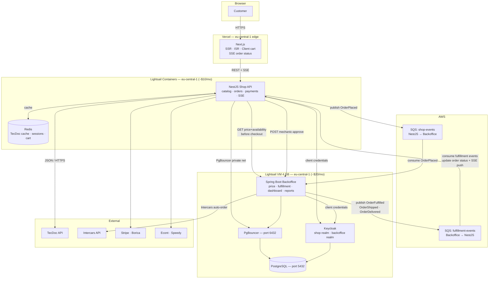

# Autoparts Shop — Architecture

## Overview

Online shop built as a TypeScript monorepo, extending an existing Spring Boot backoffice. The two systems share a single PostgreSQL database, communicate via internal REST APIs secured with Keycloak client credentials, and exchange async events through AWS SQS in both directions. The backoffice is the single source of truth for all supplier logic — pricing, stock availability, and order fulfillment routing.

---

## System Diagram



---

## Monorepo Structure

```
autoparts/
├── apps/
│   ├── web/          # Next.js frontend → deployed to Vercel
│   └── api/          # NestJS backend  → deployed to Lightsail Containers
├── packages/
│   └── shared/       # TypeScript DTOs + Zod schemas (imported by both apps)
└── infra/
    ├── docker/       # docker-compose for local dev (Postgres + Redis)
    └── lightsail/    # container service definition JSON
```

Managed with **Turborepo**. `npm run dev` from root starts both apps. The `shared` package is the contract layer — types defined once, used in both frontend and backend.

---

## Technology Stack

| Layer | Technology | Notes |
|---|---|---|
| Frontend framework | Next.js (App Router) | SSR product pages, ISR category pages |
| UI components | shadcn/ui + Tailwind | Components are owned/copied into project |
| Server state | TanStack Query | API caching, loading states |
| Client state | Zustand | Cart, selected vehicle |
| Backend framework | NestJS | Modular, DI — mirrors Spring Boot concepts |
| ORM | Prisma | Single schema file, fully typed client |
| Database | PostgreSQL | Shared with backoffice (existing Lightsail VM) |
| Cache | Redis | TecDoc cache, sessions, cart |
| Real-time | Server-Sent Events (SSE) | Order status push from NestJS to browser |
| Auth | Keycloak | Existing instance, new `shop` realm |
| Message queue | AWS SQS | Async events — two queues, both directions |
| Language | TypeScript | Both frontend and backend |

---

## Infrastructure

```
Vercel (free → Pro ~$20/mo) — eu-central-1 edge
  └── Next.js (shop frontend) — edge network, auto-scales

Lightsail Containers (~$10/mo) — eu-central-1 NEW
  └── NestJS shop API
  └── Redis (sidecar) — cache

AWS SQS (~$0/mo at launch)
  └── shop-events queue       (NestJS publishes → backoffice consumes)
  └── fulfillment-events queue (backoffice publishes → NestJS consumes)
  └── Dead-letter queues for both (failed message investigation)

Lightsail VM 4GB (~$20/mo) — eu-central-1 EXISTING, unchanged
  └── Spring Boot backoffice
  └── Keycloak
  └── PgBouncer (port 6432)
  └── PostgreSQL (port 5432) ← shared database
```

**Total: ~$30/mo at launch.** All components in eu-central-1 (Frankfurt) — minimal latency between services and to Bulgarian users.

Lightsail Containers: rolling zero-downtime deploys, scale node count manually before traffic spikes. Next.js on Vercel scales automatically at the edge.

---

## Database Ownership

One PostgreSQL instance, split into schemas with enforced permissions. Neither system writes to the other's tables directly.

```
Schema: backoffice  (Spring Boot owns — Liquibase manages migrations)
  supplier_stock        — nightly supplier sync writes here
  nomenclature          — parts catalogue
  fulfillment_tasks     — created + managed entirely by backoffice

Schema: shop  (NestJS owns — Prisma manages migrations)
  orders / order_items  — NestJS writes, backoffice reads for reporting
  customers             — NestJS writes, backoffice reads for CRM
  cart                  — NestJS only

Cross-schema permissions (enforced by Postgres users):
  shop_app user    → SELECT only on backoffice.nomenclature
  backoffice_app   → SELECT on shop.orders, shop.customers
  backoffice_app   → UPDATE on shop.orders (status updates from fulfillment events)
```

**Users:** `shop_app` (NestJS runtime), `shop_migrate` (Prisma migrations), `backoffice_app` (Spring runtime), `backoffice_migrate` (Liquibase). Migration users have DDL rights on their own schema only. Runtime users have DML only on their own schema, with the explicit cross-schema grants above.

**PgBouncer** on `port 6432` in front of Postgres on `port 5432`. Both NestJS and Spring Boot connect through PgBouncer only — neither connects to Postgres directly. Pool mode: transaction. Max client connections: 200. Default pool size: 20 per user.

> **Note:** Prisma requires `?pgbouncer=true` in the connection string when using transaction-mode pooling. This disables prepared statements which are incompatible with PgBouncer transaction mode. The migration user (`shop_migrate`) should connect directly to Postgres on port 5432, not through PgBouncer, since migrations require session-level features.

---

## Service Communication

### Frontend → Backend
REST/JSON over HTTPS. All API calls go through NestJS — the browser never calls TecDoc or the backoffice directly. Real-time order status updates delivered via **Server-Sent Events (SSE)** — NestJS pushes status changes to the customer's open browser connection immediately when a fulfillment event is consumed.

### NestJS → Backoffice (synchronous REST)
Internal REST API secured with **Keycloak client credentials** (OAuth2 `client_credentials` grant). NestJS holds a `shop-api` Keycloak client. Token cached in memory within `BackofficeClient`, refreshed when remaining lifetime drops below a configurable threshold (default 60s). Retries once with a fresh token on 401 response.

Internal endpoints on the backoffice:
- `GET  /internal/price-and-availability/:articleNumber` — best price + stock across all suppliers. Called fresh (non-cached) at checkout confirmation before payment is taken.
- `POST /internal/mechanic-approve/:customerId` — approve mechanic account registration.

Fulfillment is **not triggered via a synchronous endpoint**. After payment is confirmed, NestJS publishes `OrderPlaced` to SQS. The backoffice consumes that event and handles all fulfillment logic asynchronously. SQS durability guarantees the message is processed even if the backoffice is temporarily down.

> **gRPC note:** REST is used for all internal calls at launch. If `GET /internal/price-and-availability` becomes a bottleneck when rendering catalog pages with many parts, migrating this specific endpoint to gRPC is a natural next step — the contract is already defined in `packages/shared`.

### SQS Event Bus — Two Queues, Both Directions

Events are the primary mechanism for decoupling checkout from fulfillment and for propagating order state changes back to the customer in real time.

**Queue 1: `shop-events`** (NestJS publishes → backoffice consumes)

Published by NestJS after payment is confirmed. Backoffice is notified of new orders without being in the checkout critical path.

```json
{
  "eventType": "OrderPlaced",
  "orderId": "abc-123",
  "customerId": "xyz-789",
  "customerEmail": "customer@example.com",
  "items": [{ "articleNumber": "WL6340", "quantity": 2, "unitPrice": 24.50 }],
  "total": 49.00,
  "createdAt": "2025-01-15T08:32:00Z"
}
```

**Queue 2: `fulfillment-events`** (backoffice publishes → NestJS consumes)

Published by Spring Boot backoffice as fulfillment progresses. NestJS consumes each event, updates `shop.orders.status`, and pushes the new status to the customer via SSE.

| Event | Trigger | Customer sees |
|---|---|---|
| `OrderFulfilled` | Parts sourced and ready | "Your items have been prepared" |
| `OrderShipped` | Handed to Econt / Speedy | "Your order is on its way" + tracking |
| `OrderDelivered` | Delivery confirmed | "Your order has been delivered" |

Each queue has a corresponding dead-letter queue. Messages persist for up to 14 days if a consumer is down. Failed messages after retry exhaustion land in the DLQ for manual investigation.

### NestJS → TecDoc
JSON over HTTPS POST, proxy pattern. API key stays server-side, never exposed to browser. Circuit breaker to be added post-launch — stale Redis values returned on TecDoc incidents rather than failing customer-facing requests.

---

## Pricing, Availability and Pre-Checkout Check

The backoffice is the **single source of truth** for all supplier logic. NestJS never reads `supplier_stock` directly.

**During browsing** (user is not waiting on a critical action):
```
NestJS calls GET /internal/price-and-availability/:articleNumber
        │
        ▼
Backoffice queries supplier_stock, applies pricing rules, returns best offer
        │
        ▼
NestJS caches in Redis (5 min TTL) — serves subsequent browse requests
```

**At checkout confirmation** (before payment is taken — always fresh):
```
NestJS calls GET /internal/price-and-availability for each cart item
No Redis cache used — live backoffice response only
        │
        ├── Price / availability unchanged → proceed to payment
        └── Something changed → show customer updated info, request re-confirmation
```

This ensures the customer is always charged based on live data. The 5-minute browse cache is a performance optimisation only, never used for financial decisions.

---

## Order Flow

```
Customer confirms cart
        │
        ▼
Pre-checkout: fresh non-cached call to backoffice
  GET /internal/price-and-availability for each cart item
  Price or stock changed? → show customer updated info, request re-confirmation
  All good? → proceed to payment
        │
        ▼
Payment processed (Stripe / Borica)
        │
        ▼
NestJS writes shop.orders (status: PROCESSING)
Returns to customer: "Your order is being processed"
        │
        ├──► Publish OrderPlaced → SQS shop-events
        │         ├── Spring Boot consumes → runs fulfillment logic
        │         │         ├── Re-checks live availability in supplier_stock
        │         │         ├── Intercars → API call → auto-order placed
        │         │         └── Other supplier → creates fulfillment_tasks (PENDING_MANUAL)
        │         │                            → appears in fulfillment dashboard
        │         │                            → operator orders manually → marks done
        │         │
        │         └── NestJS email worker consumes → sends confirmation email
        │
        Backoffice publishes to SQS fulfillment-events as order progresses:
                  │
                  ├── OrderFulfilled → NestJS consumes → order: ITEMS_PREPARED
                  │                    SSE push → customer sees update
                  │
                  ├── OrderShipped  → NestJS consumes → order: ON_THE_WAY
                  │                    SSE push → customer sees tracking info
                  │
                  └── OrderDelivered → NestJS consumes → order: DELIVERED
                                       SSE push → customer sees confirmation
```

---

## Order Status Lifecycle

```
PROCESSING → ITEMS_PREPARED → ON_THE_WAY → DELIVERED
                                               
         └──────────────────────────────────► CANCELLED
         └──────────────────────────────────► FULFILLMENT_FAILED
```

Status transitions are driven exclusively by fulfillment events from the backoffice. NestJS never sets a status beyond PROCESSING on its own. Error states (`CANCELLED`, `FULFILLMENT_FAILED`) and detailed error handling to be defined during implementation.

---

## Real-Time Order Status — SSE

The order detail page in Next.js opens a Server-Sent Events connection to NestJS when the customer is viewing their order. NestJS pushes status updates immediately when it consumes a fulfillment event from SQS — no polling required.

```typescript
// NestJS — order status stream
@Sse('orders/:id/status')
orderStatus(@Param('id') orderId: string): Observable<MessageEvent> {
  return this.ordersService.statusStream(orderId);
}

// When a fulfillment event is consumed from SQS:
// 1. Update shop.orders.status in Postgres
// 2. Push new status to any open SSE connections for that orderId
```

For customers not actively viewing the order page, the status is simply reflected next time they open the order detail view.

---

## Backoffice Fulfillment Dashboard

A dedicated section in the Spring Boot backoffice UI surfaces all online shop orders requiring manual attention — separate from existing sales and delivery views.

**What it shows:**
- All `backoffice.fulfillment_tasks` with status `PENDING_MANUAL` — parts that cannot be auto-ordered via Intercars API
- Grouped by supplier, showing article number, quantity, and linked customer order
- Status progression: `PENDING_MANUAL` → `ORDERED` → `CONFIRMED`

**Operator workflow:**
1. Open fulfillment dashboard — see pending tasks grouped by supplier
2. Place the order with the supplier (phone, email, portal)
3. Mark task as `ORDERED` in the dashboard
4. When stock is confirmed / ready to ship, mark as `CONFIRMED`
5. Spring Boot publishes `OrderFulfilled` → SQS → NestJS updates shop order status → customer notified via SSE

No new application for the operator — this lives inside the existing backoffice tool.

---

## TecDoc Caching Strategy

No Postgres TecDoc tables at launch. Redis handles all TecDoc caching.

| Data | TTL | Notes |
|---|---|---|
| Vehicle manufacturers, model series | 7 days | Reference data, rarely changes |
| Vehicle types / engine variants | 7 days | Same |
| Assembly group tree | 7 days | Same |
| Article detail | 24h | |
| Part number search results | 1h | |
| Autocomplete suggestions | 30m | |
| Price + availability (from backoffice) | 5 min | Short — stock changes during day. Never used at checkout. |

Cache lookup: **Redis hit → return. Redis miss → call TecDoc API → store in Redis → return.**

**Future:** Add circuit breaker for TecDoc incidents — return stale Redis value rather than failing the request. Add Postgres `tecdoc_cache` schema when Redis memory pressure becomes measurable.

- **Part number search:** Strip known brand tokens (WIX, BOSCH, MANN…), normalize, call `getArticles` with `searchType: 10` and `searchMatchType: prefix_or_suffix`.
- **VIN/plate lookup:** Requires additional TecDoc license — post-launch.
- **Legal:** "TecAlliance TecDoc Inside" signet required on shop homepage.

---

## NestJS Module Structure

```
src/
├── catalog/        # TecDoc integration, vehicle search, parts browsing
│   └── tecdoc/     # TecDocClient, Redis cache service, DTOs
├── inventory/      # Calls backoffice /internal/price-and-availability
├── orders/         # Order state machine, checkout, SQS publisher, SSE streams
├── payments/       # Stripe, Borica, COD adapters
├── customers/      # Accounts, mechanic approval flow
├── auth/           # Keycloak JWT guard, client credentials + token cache
├── events/         # SQS consumers (fulfillment-events), email worker
└── common/         # Global exception filter, interceptors, decorators
```

---

## Next.js Rendering Strategy

| Page type | Strategy | Reason |
|---|---|---|
| Homepage | ISR (revalidate 6h) | SEO, mostly static |
| Category pages | ISR (revalidate 1h) | SEO, high traffic, infrequent changes |
| Product detail | SSR | Fresh stock and price on each request |
| Vehicle selector | Client component | Interactive cascading state |
| Cart / Checkout | Client component | Dynamic, user-specific |
| Order detail | Client component + SSE | Real-time status updates |

---

## Auth Flow

- Keycloak on existing VM, new `shop` realm separate from backoffice realm.
- **End users:** Customers self-register. Mechanics submit registration → backoffice approves → Keycloak Admin API assigns `ROLE_MECHANIC`. NestJS validates JWT on every protected request via `JwtGuard`. Mechanic accounts receive B2B pricing from the backoffice price endpoint.
- **Service-to-service:** NestJS uses Keycloak client credentials for all backoffice calls. Token cached in memory within `BackofficeClient`. Refreshed when remaining lifetime drops below configurable threshold (default 60s). Retries once with fresh token on 401.

---

## Nightly Supplier Sync

Owned by Spring Boot backoffice. Runs after suppliers publish updated stock (currently 8am). Processes ~7M rows — diffs quantity, price, availability, upserts changes to `backoffice.supplier_stock`. Throttled with inter-batch sleeps to reduce CPU impact during business hours.

**Future:** Extract to standalone Spring Batch container on Lightsail scheduled task — independently deployable, restartable from failure point, no impact on backoffice web process.

---

## CI/CD

```
Push to main
  └── GitHub Actions
        ├── Type-check + lint (both apps)
        ├── Build NestJS Docker image
        ├── Run Prisma migrations (shop schema only, direct Postgres port 5432)
        ├── Push image to Lightsail Container Registry
        └── Trigger rolling deploy (zero downtime)

  └── Vercel (automatic via GitHub integration)
        └── Deploy Next.js to edge network
        └── Preview URL on every PR
```

Secrets in GitHub Actions secrets (CI) and Lightsail console environment variables (runtime). Never committed. `.env.example` documents all required variables.

---

## Key Decisions

- **Backoffice owns all supplier logic** — pricing rules, stock routing, fulfillment decisions in one place. Shop is a presentation and checkout layer only.
- **Two SQS queues, both directions** — `shop-events` (NestJS → backoffice) carries `OrderPlaced` which triggers all fulfillment logic in the backoffice. No synchronous fulfill endpoint — SQS durability handles backoffice downtime naturally. `fulfillment-events` (backoffice → NestJS) drives the order status lifecycle and real-time customer updates via SSE.
- **Pre-checkout live availability check** — always a fresh non-cached call to the backoffice before payment. Redis cache is for browse performance only, never used for financial decisions.
- **SSE for real-time order status** — NestJS pushes status changes to the customer's browser when fulfillment events are consumed. No polling.
- **Keycloak client credentials for all service-to-service calls** — token cached in memory, refreshed at 60s threshold, retries once on 401.
- **`fulfillment_tasks` in backoffice schema** — backoffice owns and manages fulfillment entirely. Shop gets SELECT only to read task status.
- **`shop_app` has no access to `supplier_stock`** — NestJS never reads supplier data directly. All pricing and availability queries go through the backoffice internal API.
- **PgBouncer transaction mode + Prisma** — requires `?pgbouncer=true` in NestJS connection string. Migration user connects directly to Postgres on port 5432, bypassing PgBouncer.
- **Shared Postgres, split schemas** — Liquibase manages backoffice schema, Prisma manages shop schema. Permissions enforced at DB level.
- **All components in eu-central-1** — Lightsail VM, Lightsail Containers, and Vercel edge all in Frankfurt. Minimal latency between services and to Bulgarian users.
- **No TecDoc Postgres cache at launch** — Redis TTLs sufficient. Circuit breaker and Postgres cache added when Redis pressure is measurable.
- **Prisma over TypeORM** — single schema file, superior type safety.
- **Node.js 22 over Bun** — production stability; Bun viable future swap.