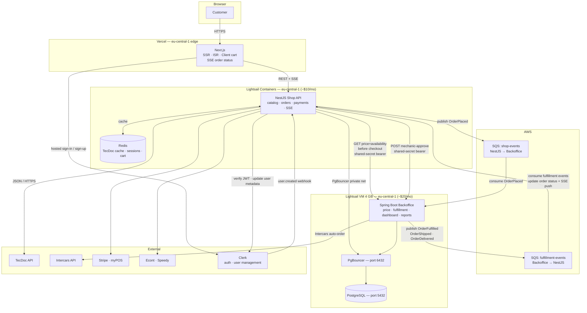

# Autoparts Shop — Architecture

## Overview

Online shop built as a TypeScript monorepo, extending an existing Spring Boot backoffice. The two systems share a single PostgreSQL database, exchange async events through AWS SQS in both directions, and use a small internal REST surface (secured with a shared-secret bearer token, private-network only) for a few command operations such as mechanic approval. The backoffice remains the single source of truth for all supplier logic — it computes pricing and stock and writes it into the shared database — but the shop now reads price and availability **directly** from that database (read-only, column-scoped) rather than over an internal REST endpoint. The backoffice still owns order fulfillment routing.

---

## System Diagram


```mermaid
graph TB
    subgraph Browser
        U[Customer]
    end

    subgraph Vercel ["Vercel — eu-central-1 edge"]
        WEB["Next.js\nSSR · ISR · Client cart\nSSE order status"]
    end

    subgraph LC ["Lightsail Containers — eu-central-1 (~$10/mo)"]
        API["NestJS Shop API\ncatalog · orders · payments · SSE"]
        REDIS[(Redis\nTecDoc cache · sessions · cart)]
    end

    subgraph AWS
        SQS1["SQS: shop-events\nNestJS → Backoffice"]
        SQS2["SQS: fulfillment-events\nBackoffice → NestJS"]
    end

    subgraph VM ["Lightsail VM 4 GB — eu-central-1 (~$20/mo)"]
        SPRING["Spring Boot Backoffice\nprice · fulfillment · dashboard · reports"]
        PGBOUNCER["PgBouncer — port 6432"]
        PG[(PostgreSQL — port 5432)]
    end

    subgraph External
        TECDOC[TecDoc API]
        INTERCARS[Intercars API]
        PAY["Stripe · myPOS"]
        SHIP["Econt · Speedy"]
        CLERK["Clerk\nauth · user management"]
    end

    U -->|HTTPS| WEB
    WEB -->|REST + SSE| API
    API <-->|cache| REDIS
    API -->|PgBouncer private net| PGBOUNCER
    API -->|GET price+availability\nbefore checkout\nshared-secret bearer| SPRING
    API -->|POST mechanic-approve\nshared-secret bearer| SPRING
    API -->|publish OrderPlaced| SQS1
    SQS1 -->|consume OrderPlaced| SPRING
    SPRING -->|publish OrderFulfilled\nOrderShipped · OrderDelivered| SQS2
    SQS2 -->|consume fulfillment events\nupdate order status + SSE push| API
    SPRING -->|Intercars auto-order| INTERCARS
    SPRING --> PGBOUNCER
    PGBOUNCER --> PG
    WEB -->|hosted sign-in / sign-up| CLERK
    API -->|verify JWT · update user metadata| CLERK
    CLERK -->|user.created webhook| API
    API -->|JSON / HTTPS| TECDOC
    API --> PAY
    API --> SHIP
```

---

## Monorepo Structure

```
autoparts/
├── apps/
│   ├── web/          # Next.js frontend → deployed to Vercel
│   └── api/          # NestJS backend  → deployed to Lightsail Containers
├── packages/
│   └── shared/       # TypeScript DTOs + Zod schemas (imported by both apps)
└── infra/
    ├── docker/       # docker-compose for local dev (Postgres + Redis)
    └── lightsail/    # container service definition JSON
```

Managed with **Turborepo**. `npm run dev` from root starts both apps. The `shared` package is the contract layer — types defined once, used in both frontend and backend.

---

## Technology Stack

| Layer | Technology | Notes |
|---|---|---|
| Frontend framework | Next.js (App Router) | SSR product pages, ISR category pages |
| UI components | shadcn/ui + Tailwind | Components are owned/copied into project |
| Server state | TanStack Query | API caching, loading states |
| Client state | Zustand | Cart, selected vehicle |
| Backend framework | NestJS | Modular, DI — mirrors Spring Boot concepts |
| ORM | Prisma | Single schema file, fully typed client |
| Database | PostgreSQL | Shared with backoffice (existing Lightsail VM) |
| Cache | Redis | TecDoc cache, sessions, cart |
| Real-time | Server-Sent Events (SSE) | Order status push from NestJS to browser |
| Auth | Clerk | Hosted sign-in/sign-up UI, JWT issuance, webhook-driven DB sync |
| Message queue | AWS SQS | Async events — two queues, both directions |
| Language | TypeScript | Both frontend and backend |

---

## Infrastructure

```
Vercel (free → Pro ~$20/mo) — eu-central-1 edge
  └── Next.js (shop frontend) — edge network, auto-scales

Lightsail Containers (~$10/mo) — eu-central-1 NEW
  └── NestJS shop API
  └── Redis (sidecar) — cache

AWS SQS (~$0/mo at launch)
  └── shop-events queue       (NestJS publishes → backoffice consumes)
  └── fulfillment-events queue (backoffice publishes → NestJS consumes)
  └── Dead-letter queues for both (failed message investigation)

Lightsail VM 4GB (~$20/mo) — eu-central-1 EXISTING, unchanged
  └── Spring Boot backoffice
  └── PgBouncer (port 6432)
  └── PostgreSQL (port 5432) ← shared database

Clerk (SaaS — external)
  └── Hosted sign-in / sign-up pages
  └── JWT issuance (RS256, auto-rotating keys)
  └── Webhook: user.created → NestJS creates Customer record
```

**Total: ~$30/mo at launch.** All components in eu-central-1 (Frankfurt) — minimal latency between services and to Bulgarian users.

Lightsail Containers: rolling zero-downtime deploys, scale node count manually before traffic spikes. Next.js on Vercel scales automatically at the edge.

---

## Database Ownership

One PostgreSQL instance, split into schemas with enforced permissions. Neither system writes to the other's tables directly.

```
Schema: public  (Spring Boot owns — Liquibase manages migrations)
  autoparts             — OUR OWN stock (primary price/availability source)
  supplier_stock        — supplier stock projection (fallback source); nightly sync writes here
  nomenclature          — parts catalogue
  fulfillment_tasks     — created + managed entirely by backoffice

Schema: shop  (NestJS owns — Prisma manages migrations)
  orders / order_items  — NestJS writes, backoffice reads for reporting
  customers             — NestJS writes, backoffice reads for CRM
  cart                  — NestJS only

Cross-schema permissions (enforced by Postgres users):
  shop_app user    → SELECT (column-scoped) on public.autoparts      (own stock — no cost/internal columns)
  shop_app user    → SELECT (column-scoped) on public.supplier_stock (incl. buy_price, to pick the best supplier)
  backoffice_app   → SELECT on shop.orders, shop.customers
  backoffice_app   → UPDATE on shop.orders (status updates from fulfillment events)
```

**Users:** `shop_app` (NestJS runtime), `shop_migrate` (Prisma migrations), `backoffice_app` (Spring runtime), `backoffice_migrate` (Liquibase). Migration users have DDL rights on their own schema only. Runtime users have DML only on their own schema, with the explicit cross-schema grants above.

**PgBouncer** on `port 6432` in front of Postgres on `port 5432`. Both NestJS and Spring Boot connect through PgBouncer only — neither connects to Postgres directly. Pool mode: transaction. Max client connections: 200. Default pool size: 20 per user.

> **Note:** Prisma requires `?pgbouncer=true` in the connection string when using transaction-mode pooling. This disables prepared statements which are incompatible with PgBouncer transaction mode. The runtime client uses this pooled connection via `DATABASE_URL` (declared in `schema.prisma`). The migration user (`shop_migrate`) must connect directly to Postgres on port 5432, not through PgBouncer, since migrations require session-level features — this direct, non-pooled connection is supplied via `DIRECT_URL`, which `prisma.config.ts` uses for all CLI commands. `DIRECT_URL` falls back to `DATABASE_URL` for local/CI environments that have no pooler.

---

## Service Communication

### Frontend → Backend
REST/JSON over HTTPS. All API calls go through NestJS — the browser never calls TecDoc or the backoffice directly. Real-time order status updates delivered via **Server-Sent Events (SSE)** — NestJS pushes status changes to the customer's open browser connection immediately when a fulfillment event is consumed.

### NestJS → Backoffice (synchronous REST)
Internal REST API secured with a **shared-secret bearer token**. Both NestJS and Spring Boot hold the same secret in their environment (`INTERNAL_API_TOKEN`). NestJS includes `Authorization: Bearer <INTERNAL_API_TOKEN>` on every internal call. The backoffice verifies the token on arrival. Internal endpoints are only reachable within the Lightsail private network — they are not exposed to the public internet.

Internal endpoints on the backoffice:
- `POST /internal/mechanic-approve/:customerId` — approve mechanic account registration.

Price and availability is **no longer** served by an internal endpoint — NestJS reads it directly from the shared database (see next section).

Fulfillment is **not triggered via a synchronous endpoint**. After payment is confirmed, NestJS publishes `OrderPlaced` to SQS. The backoffice consumes that event and handles all fulfillment logic asynchronously. SQS durability guarantees the message is processed even if the backoffice is temporarily down.

### NestJS → Shared DB (direct, read-only)
Price and availability are read **directly from the shared PostgreSQL database** over the private network — there is no internal price/availability REST hop. The `shop_app` role holds a **column-scoped, read-only `SELECT`** grant on two backoffice tables: `public.autoparts` (our own stock — the primary source, granted only the customer-safe columns, never cost/internal columns) and `public.supplier_stock` (the fallback source, including `buy_price` so the shop can pick the best supplier). These tables are not modelled in Prisma; the `inventory` repositories read them with parameterised `prisma.$queryRaw`. This keeps live availability a single in-network query with no extra service hop, and database permissions enforce that the shop can never see anything beyond the granted columns.

### SQS Event Bus — Two Queues, Both Directions

Events are the primary mechanism for decoupling checkout from fulfillment and for propagating order state changes back to the customer in real time.

**Queue 1: `shop-events`** (NestJS publishes → backoffice consumes)

Published by NestJS after payment is confirmed. Backoffice is notified of new orders without being in the checkout critical path.

```json
{
  "eventType": "OrderPlaced",
  "orderId": "abc-123",
  "customerId": "xyz-789",
  "customerEmail": "customer@example.com",
  "items": [{ "articleNumber": "WL6340", "quantity": 2, "unitPrice": 24.50 }],
  "total": 49.00,
  "createdAt": "2025-01-15T08:32:00Z"
}
```

**Queue 2: `fulfillment-events`** (backoffice publishes → NestJS consumes)

Published by Spring Boot backoffice as fulfillment progresses. NestJS consumes each event, updates `shop.orders.status`, and pushes the new status to the customer via SSE.

| Event | Trigger | Customer sees |
|---|---|---|
| `OrderFulfilled` | Parts sourced and ready | "Your items have been prepared" |
| `OrderShipped` | Handed to Econt / Speedy | "Your order is on its way" + tracking |
| `OrderDelivered` | Delivery confirmed | "Your order has been delivered" |

Each queue has a corresponding dead-letter queue. Messages persist for up to 14 days if a consumer is down. Failed messages after retry exhaustion land in the DLQ for manual investigation.

### NestJS → TecDoc
JSON over HTTPS POST, proxy pattern. API key stays server-side, never exposed to browser. Circuit breaker to be added post-launch — stale Redis values returned on TecDoc incidents rather than failing customer-facing requests.

---

## Pricing, Availability and Pre-Checkout Check

The backoffice computes and **writes** all supplier pricing/stock into the shared database; the shop **reads** it directly (read-only) and derives a single displayed offer per part. There is no internal price/availability REST hop. The selection logic lives in the `inventory` module — a pure `selectBestOffer` function fed by two read-only repositories.

> **Plain-language deep dive:** see [`docs/PRICING-AND-DELIVERY.md`](./PRICING-AND-DELIVERY.md) for a worked-example walkthrough of how we pick the price and the delivery date, including a decision diagram.

### Own-stock-first best-offer algorithm

For a given `tecdoc_number`:

1. **Our own stock (`public.autoparts`) is primary.** If we carry the part, the displayed price is **always our** sell price (`sell_price_net` ex-VAT, `gross_price` inc-VAT — taken directly, no VAT recompute) and our `available_quantity` is treated as the fastest (own-stock, rank 0) band. We never undercut the supplier we would actually source from: if our price is below that supplier's sell price we raise the displayed price up to it; otherwise we keep ours.
2. **Suppliers (`public.supplier_stock`) layer on top.** Each supplier line is resolved to a delivery band from its `supplier_source` + `warehouse_code`. Supplier quantity is added onto the matching delivery band (today / next day / 2–3 days).
3. **Supplier-only fallback** (no `autoparts` row): among the **fastest delivery band** that has stock, the supplier with the **lowest `buy_price`** wins and we display **their** `sell_price`; the ex-VAT figure is derived from it via `VAT_RATE`.
4. The fastest band with stock sets the displayed price. Availability is reported only per warehouse (there is no top-level quantity field, and no stock-status or estimated-days field — they would just duplicate the per-warehouse breakdown). The per-supplier source split is kept server-side only (it carries buy prices). The customer-facing breakdown `availabilityByWarehouse` groups supplier stock into fictional warehouses (Central / Regional 1·2 / Romania / Poland) with concrete pickup and courier dates computed server-side. The warehouse model is what the detail page renders — the frontend derives its per-warehouse delivery label straight from that breakdown; see [DELIVERY-LOGIC.md](./DELIVERY-LOGIC.md) for the full delivery-date computation.

Delivery bands are an **internal** numeric speed rank (`DeliveryOutcome.rank` in `delivery.ts`): own stock is fixed to rank 0, and each supplier `DeliveryRule` maps to a rank (within-hour → same-day → next-day → 2 days → 3 days), resolved from a warehouse→rule map per supplier with an 11:00 `Europe/Sofia` same-day cut-off. This rank orders offers to pick the fastest one for the price; it is **not** exposed over HTTP. The price shown to **all** customers is this single locked sell price — mechanic trade pricing is a separate per-mechanic discount applied later, not part of the inventory layer.

The error policy is fixed per read shape, not per caller: a **single**-article read
fails *open*, a **bulk** read fails *closed*. (This concerns read failures only — an
article that genuinely has no stock always resolves to `available: false`.)

**Single-article buy box** (product detail — fails *open*):
```
inventory.getBestPriceAndAvailability(tecdocNumber)
  → read public.autoparts + public.supplier_stock → selectBestOffer
  → on a DB error: serve a neutral "unavailable" state (a lone buy box has
    nothing else to show, so the customer just cannot add it until it recovers)
```

**Bulk lists** (catalog grid, search, substitutes — fails *closed*):
```
inventory.getBulkPricesAndAvailability([tecdocNumber, ...], { withWarehouses })
  → one pair of grouped reads → selectBestOffer per article
  → on a DB error: throw InventoryUnavailableException (503 / INVENTORY_UNAVAILABLE)
        │
        ▼
Caller shows a single "try again later" state instead of a grid of false
"out of stock" rows (misleading). Cached listing payloads never store the error.
```

All three surfaces feed the same list-row shape (`ArticleListItemDto`, catalog
metadata + full per-warehouse availability), enriched through one path
(`CatalogService` → `getArticlesAvailability`, the bulk read with
`withWarehouses`). The catalog grid is special: its **metadata** is cached
(`GET /catalog/.../articles`, `PaginatedCatalogArticlesDto`, no inventory) and its
**availability** is read live and separately (`GET /catalog/articles-availability`,
`no-store`), then merged on the frontend — mirroring the article detail page's
cached-metadata / live-availability split so a cached grid never serves a stale
delivery date. Search and substitutes are already dynamic, so they enrich in one
call server-side.

**At checkout confirmation** (before payment — always fresh, fails *closed*):
```
CheckoutService → inventory.getBulkPricesAndAvailability(cart tecdocNumbers)
  → in-process call, direct DB read, no Redis, every request (not an HTTP hop)
        │
        ├── Price / availability unchanged → proceed to payment
        ├── Something changed → show customer updated info, request re-confirmation
        └── DB read fails → InventoryUnavailableException (checkout fails closed)
```

Checkout re-validates through the same bulk read (a cart is naturally multi-item), so
it inherits the fail-closed policy for free — a DB blip aborts the order rather than
selling stale stock. This ensures the customer is always charged based on live data.
The browse cache is a performance optimisation only, never used for financial decisions.

> **Matching** is by `tecdoc_number` only for now (both tables). A `supplier_code` / `catalog_number` fallback for rows without a TecDoc number is a documented future enhancement.

---

## Order Flow

```
Customer confirms cart
        │
        ▼
Pre-checkout: fresh non-cached direct DB read for the whole cart
  inventory.getBulkPricesAndAvailability(cart tecdocNumbers) — reads autoparts + supplier_stock, no cache
  Price or stock changed? → show customer updated info, request re-confirmation
  DB read fails? → InventoryUnavailableException (fail closed)
  All good? → proceed to payment
        │
        ▼
Payment processed (Stripe / myPOS)
        │
        ▼
NestJS writes shop.orders (status: PROCESSING)
Returns to customer: "Your order is being processed"
        │
        ├──► Publish OrderPlaced → SQS shop-events
        │         ├── Spring Boot consumes → runs fulfillment logic
        │         │         ├── Re-checks live availability in supplier_stock
        │         │         ├── Intercars → API call → auto-order placed
        │         │         └── Other supplier → creates fulfillment_tasks (PENDING_MANUAL)
        │         │                            → appears in fulfillment dashboard
        │         │                            → operator orders manually → marks done
        │         │
        │         └── NestJS email worker consumes → sends confirmation email
        │
        Backoffice publishes to SQS fulfillment-events as order progresses:
                  │
                  ├── OrderFulfilled → NestJS consumes → order: ITEMS_PREPARED
                  │                    SSE push → customer sees update
                  │
                  ├── OrderShipped  → NestJS consumes → order: ON_THE_WAY
                  │                    SSE push → customer sees tracking info
                  │
                  └── OrderDelivered → NestJS consumes → order: DELIVERED
                                       SSE push → customer sees confirmation
```

---

## Order Status Lifecycle

```
PROCESSING → ITEMS_PREPARED → ON_THE_WAY → DELIVERED
                                               
         └──────────────────────────────────► CANCELLED
         └──────────────────────────────────► FULFILLMENT_FAILED
```

Status transitions are driven exclusively by fulfillment events from the backoffice. NestJS never sets a status beyond PROCESSING on its own. Error states (`CANCELLED`, `FULFILLMENT_FAILED`) and detailed error handling to be defined during implementation.

---

## Real-Time Order Status — SSE

The order detail page in Next.js opens a Server-Sent Events connection to NestJS when the customer is viewing their order. NestJS pushes status updates immediately when it consumes a fulfillment event from SQS — no polling required.

```typescript
// NestJS — order status stream
@Sse('orders/:id/status')
orderStatus(@Param('id') orderId: string): Observable<MessageEvent> {
  return this.ordersService.statusStream(orderId);
}

// When a fulfillment event is consumed from SQS:
// 1. Update shop.orders.status in Postgres
// 2. Push new status to any open SSE connections for that orderId
```

For customers not actively viewing the order page, the status is simply reflected next time they open the order detail view.

---

## Backoffice Fulfillment Dashboard

A dedicated section in the Spring Boot backoffice UI surfaces all online shop orders requiring manual attention — separate from existing sales and delivery views.

**What it shows:**
- All `backoffice.fulfillment_tasks` with status `PENDING_MANUAL` — parts that cannot be auto-ordered via Intercars API
- Grouped by supplier, showing article number, quantity, and linked customer order
- Status progression: `PENDING_MANUAL` → `ORDERED` → `CONFIRMED`

**Operator workflow:**
1. Open fulfillment dashboard — see pending tasks grouped by supplier
2. Place the order with the supplier (phone, email, portal)
3. Mark task as `ORDERED` in the dashboard
4. When stock is confirmed / ready to ship, mark as `CONFIRMED`
5. Spring Boot publishes `OrderFulfilled` → SQS → NestJS updates shop order status → customer notified via SSE

No new application for the operator — this lives inside the existing backoffice tool.

---

## TecDoc Caching Strategy

No Postgres TecDoc tables at launch. Redis handles all TecDoc caching.

| Data | TTL | Notes |
|---|---|---|
| Vehicle manufacturers, model series | 7 days | Reference data, rarely changes |
| Vehicle types / engine variants | 7 days | Same |
| Assembly group tree | 7 days | Same |
| Article detail | 24h | |
| Part number search results | 1h | |
| Autocomplete suggestions | 30m | |
| Price + availability (direct DB read) | none | Read live from `public.autoparts` + `supplier_stock` per request. The value rides along inside the catalog listing/detail payload's own cache; the inventory read itself is never separately cached and is `no-store` on the live availability endpoint. |

Cache lookup: **Redis hit → return. Redis miss → call TecDoc API → store in Redis → return.**

**Future:** Add circuit breaker for TecDoc incidents — return stale Redis value rather than failing the request. Add Postgres `tecdoc_cache` schema when Redis memory pressure becomes measurable.

- **Part number search:** Strip known brand tokens (WIX, BOSCH, MANN…), normalize, call `getArticles` with `searchType: 10` and `searchMatchType: prefix_or_suffix`.
- **VIN/plate lookup:** Requires additional TecDoc license — post-launch.
- **Legal:** "TecAlliance TecDoc Inside" signet required on shop homepage.

---

## NestJS Module Structure

```
src/
├── catalog/        # TecDoc integration, vehicle search, parts browsing
│   └── tecdoc/     # TecDocClient, Redis cache service, DTOs
├── inventory/      # Direct read-only reads of public.autoparts + supplier_stock; best-offer selection
├── orders/         # Order state machine, checkout, SQS publisher, SSE streams
├── payments/       # Stripe, myPOS, COD adapters
├── customers/      # Accounts, mechanic approval flow, Clerk webhook handler
├── auth/           # Clerk JWT guard, InternalGuard (shared-secret), @Public() decorator
├── events/         # SQS consumers (fulfillment-events), email worker
└── common/         # Global exception filter, interceptors, decorators
```

---

## Next.js Rendering Strategy

| Page type | Strategy | Reason |
|---|---|---|
| Homepage | ISR (revalidate 6h) | SEO, mostly static |
| Category pages | ISR (revalidate 1h) | SEO, high traffic, infrequent changes |
| Product detail | SSR | Fresh stock and price on each request |
| Vehicle selector | Client component | Interactive cascading state |
| Cart / Checkout | Client component | Dynamic, user-specific |
| Order detail | Client component + SSE | Real-time status updates |

---

## Auth Flow

- **Auth provider**: Clerk (SaaS). No self-hosted Keycloak. Clerk issues RS256 JWTs; NestJS verifies them using `@clerk/backend` SDK.
- **End users:** Customers sign up and sign in via Clerk's hosted pages (or Clerk's embedded `<SignIn>` / `<SignUp>` components in the Next.js frontend). After registration, Clerk fires a `user.created` webhook; NestJS receives it, verifies the Clerk webhook signature, and creates a `Customer` record in Postgres. Custom fields (phone number) are collected via a short onboarding step after first sign-in — `PATCH /customers/me`.
- **Mechanic approval:** Mechanic submits application → NestJS saves `MechanicProfile` as `PENDING`. Backoffice operator approves via `POST /internal/mechanic-approve/:customerId`. NestJS upgrades `Customer.role` to `MECHANIC` in Postgres **and** calls the Clerk Backend API to set `publicMetadata.role = 'MECHANIC'` on the Clerk user. The mechanic's next JWT session will carry `role: MECHANIC` in its public metadata claims — NestJS `JwtGuard` reads the role from the JWT without a DB lookup.
- **Service-to-service:** Spring Boot backoffice calls NestJS internal endpoints using `Authorization: Bearer <INTERNAL_API_TOKEN>`. NestJS `InternalGuard` compares the token to `process.env.INTERNAL_API_TOKEN`. Internal endpoints are bound to the private Lightsail network interface and are not reachable from the public internet — the shared secret is a defence-in-depth measure, not the primary access control.

---

## Nightly Supplier Sync

Owned by Spring Boot backoffice. Runs after suppliers publish updated stock (currently 8am). Processes ~7M rows — diffs quantity, price, availability, upserts changes to `backoffice.supplier_stock`. Throttled with inter-batch sleeps to reduce CPU impact during business hours.

**Future:** Extract to standalone Spring Batch container on Lightsail scheduled task — independently deployable, restartable from failure point, no impact on backoffice web process.

---

## CI/CD

```
Push to main
  └── GitHub Actions
        ├── Type-check + lint (both apps)
        ├── Build NestJS Docker image
        ├── Run Prisma migrations (shop schema only, direct Postgres port 5432)
        ├── Push image to Lightsail Container Registry
        └── Trigger rolling deploy (zero downtime)

  └── Vercel (automatic via GitHub integration)
        └── Deploy Next.js to edge network
        └── Preview URL on every PR
```

Secrets in GitHub Actions secrets (CI) and Lightsail console environment variables (runtime). Never committed. `.env.example` documents all required variables.

---

## Key Decisions

- **Backoffice owns all supplier logic** — it computes pricing and stock and writes them into the shared DB, and owns stock routing and fulfillment decisions. The shop is a presentation and checkout layer that reads price/availability directly (read-only) and derives the displayed offer.
- **Two SQS queues, both directions** — `shop-events` (NestJS → backoffice) carries `OrderPlaced` which triggers all fulfillment logic in the backoffice. No synchronous fulfill endpoint — SQS durability handles backoffice downtime naturally. `fulfillment-events` (backoffice → NestJS) drives the order status lifecycle and real-time customer updates via SSE.
- **Own-stock-first best-offer** — the shop reads our own stock (`public.autoparts`) first and locks the displayed price to our sell price, then layers `public.supplier_stock` on top (fastest delivery band → lowest `buy_price`, never undercutting the sourced supplier). A single locked price is shown to all customers; per-mechanic trade discounts are applied separately later.
- **Pre-checkout live availability check** — always a fresh non-cached direct DB read before payment, failing *closed* (`InventoryUnavailableException`) on a DB error. Redis cache is for browse performance only, never used for financial decisions.
- **SSE for real-time order status** — NestJS pushes status changes to the customer's browser when fulfillment events are consumed. No polling.
- **Shared-secret bearer token for all service-to-service calls** — `INTERNAL_API_TOKEN` shared between NestJS and Spring Boot. Internal endpoints are private-network only; shared secret is defence in depth.
- **Clerk for all user auth** — hosted sign-in/sign-up UI, JWT issuance, and user webhook (`user.created`) drive Customer DB sync. No self-hosted Keycloak required.
- **`fulfillment_tasks` in backoffice schema** — backoffice owns and manages fulfillment entirely. Shop gets SELECT only to read task status.
- **`shop_app` reads stock directly, column-scoped** — NestJS reads `public.autoparts` and `public.supplier_stock` over the private network with read-only, column-scoped `SELECT` grants (no cost/internal columns on `autoparts`). Database permissions are the enforcement boundary; the legacy backoffice price/availability REST endpoint is no longer used.
- **PgBouncer transaction mode + Prisma** — requires `?pgbouncer=true` in the pooled `DATABASE_URL` used by the runtime client. Migrations connect directly to Postgres on port 5432 via `DIRECT_URL` (consumed by `prisma.config.ts`), bypassing PgBouncer; `DIRECT_URL` falls back to `DATABASE_URL` where no pooler exists.
- **Shared Postgres, split schemas** — Liquibase manages backoffice schema, Prisma manages shop schema. Permissions enforced at DB level.
- **All components in eu-central-1** — Lightsail VM, Lightsail Containers, and Vercel edge all in Frankfurt. Minimal latency between services and to Bulgarian users.
- **No TecDoc Postgres cache at launch** — Redis TTLs sufficient. Circuit breaker and Postgres cache added when Redis pressure is measurable.
- **Prisma over TypeORM** — single schema file, superior type safety.
- **Node.js 22 over Bun** — production stability; Bun viable future swap.