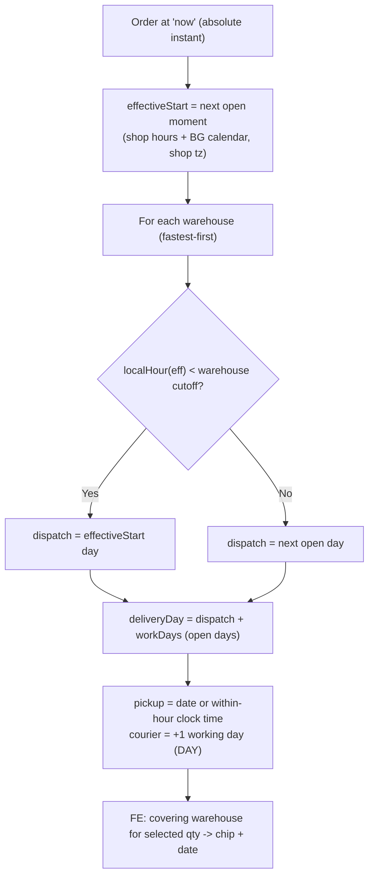

# Delivery Logic — How We Compute the Delivery Date

This document explains how the shop turns raw stock into a **concrete delivery
promise** for the customer. It is the human-readable companion to the code in
`apps/api/src/inventory/` (the backend is the source of truth — if the two
disagree, the code wins, but please update this file too).

For how we pick the **price** and which stock counts, see
[PRICING-AND-DELIVERY.md](./PRICING-AND-DELIVERY.md). This file is only about the
**delivery date**.

> **One-line summary:** The backend normalises "now" to the next moment the shop
> is open, applies a per-warehouse order cut-off, counts working days on the
> Bulgarian calendar, and returns a concrete pickup/courier date per
> customer-facing warehouse. The frontend just formats those dates.

---

## Audience strategies

| Audience | Status | Fulfilment shown |
|---|---|---|
| **B2C** (guests + non-mechanics) | Implemented | Shop **pickup** (warehouse term) and **courier** (+1 working day) |
| **B2B** (logged-in mechanics) | Deferred (no Clerk yet) | Will get car delivery by default; courier optional. `TODO(b2b)` |

Everything below describes the **B2C** model.

---

## Timezone safety (read this first)

The app is deployed to `eu-central-1`, so the server's local clock is **not**
Bulgarian time. Every "now" we handle is an absolute instant (a JS `Date`), which
is identical everywhere. We **never** read server-local fields (`getHours`,
`getDate`, ...). Instead, `working-calendar.ts` projects instants into the shop's
civil calendar via `Intl.DateTimeFormat` with an explicit `SHOP_TIMEZONE`, does
all reasoning on those civil parts, and converts back to an instant only when
emitting `earliestAt`. The wire format is a UTC ISO string; the frontend formats
it back in the shop timezone.

---

## The shop schedule

The shop is physically open on a weekly schedule (all configurable):

| Day | Hours |
|---|---|
| Mon-Fri | 09:00 - 18:00 |
| Saturday | 09:00 - 14:00 |
| Sunday | closed |
| Bulgarian public holidays | closed |

Holiday dates come from the maintained [`date-holidays`](https://www.npmjs.com/package/date-holidays)
library (fixed national days + the movable Orthodox Easter cluster, Good Friday →
Easter Monday — no hand-rolled Easter algorithm). On top of the library dates,
`working-calendar.ts` applies the **Bulgarian Labour Code art. 154(2)
weekend-substitution rule**: when an official holiday other than the Easter
cluster falls on a Saturday or Sunday, the first following working day becomes
non-working, cascading across consecutive weekend holidays (e.g. the 2026
Christmas cluster pushes a substitute to Mon 28 Dec). Results are computed once
per year and cached.

A **working day** for delivery counting is *any day the shop is open* — so
Saturday counts as a working day.

---

## Effective order time

All projection starts from `effectiveStart` = the next moment the shop is open at
or after `now`:

- **Open now** (e.g. Thu 10:12) → `effectiveStart = now`.
- **Before opening** (e.g. 03:00) → `effectiveStart = today 09:00`.
- **After close / weekend / holiday** (e.g. Fri 20:00) → `effectiveStart = next open day 09:00`.

The "+1 day after 18:00" behaviour falls out of this for free: after close,
`effectiveStart` rolls to the next open day, so every band shifts forward.

---

## Warehouses

We present our suppliers' stock as if it lived in our **own** warehouse network —
the customer never sees a supplier name. Each warehouse is a **static** grouping
of stock by the supplier's *inherent* delivery capability (not the live clock),
so e.g. Regional 1 always represents same-day-capable stock even after 11:00.

| Warehouse | Groups | Work days | Order cut-off |
|---|---|---|---|
| **Central** | Own stock + within-the-hour suppliers | 0 | Shop close (18:00, Sat 14:00) |
| **Regional 1** | Same-day-capable suppliers (`SAME_DAY_BEFORE_CUTOFF`) | 0 | 11:00 |
| **Regional 2** | Next-day suppliers (`NEXT_DAY`) | 1 | 17:00 |
| **Romania** | 2-day suppliers | 2 | 17:00 |
| **Poland** | 3-day suppliers | 3 | 17:00 |

The mapping `DeliveryRule → Warehouse` lives in `warehouse.ts`. Quantities are
**united** per warehouse.

---

## Per-warehouse cut-offs (active)

Each warehouse has an order cut-off. Missing it pushes that warehouse's dispatch
to the next working day:

```
made        = localHour(effectiveStart) < warehouse.cutoffHour
dispatchDay = made ? date(effectiveStart) : nextOpenDay(after effectiveStart)
deliveryDay = addWorkingDays(dispatchDay, warehouse.workDays)
```

Worked examples (Thursday, summer):

| Order time | Warehouse | Result |
|---|---|---|
| 10:12 | Regional 1 (same-day) | Delivered **today** (before 11:00) |
| 11:30 | Regional 1 | Slips to **next working day** (missed 11:00) |
| 16:00 | Regional 2 (next-day) | **+1 working day** (Friday) |
| 17:30 | Regional 2 | **+2 working days** (missed 17:00 → dispatch Fri → +1 = Sat) |
| 18:30 | Central (in stock) | **Next working day** (shop closed; processed next day) |

---

## Within-the-hour clock time

The Central warehouse, when delivering the **same calendar day**, is shown as a
clock time = `effectiveStart + WITHIN_HOUR_OFFSET_MINUTES` (default 60), with
`granularity: "HOUR"`:

- Order 10:12 → "за 11:12".
- Order 03:00 (before open) → "за 10:00" (09:00 + 1h).
- Order after close → rolls to the next day and is shown as a date (`DAY`).

The time is clamped to the shop's closing hour. `TODO(within-hour-edge)`: an order
~1h before close (17:30 → 18:30) is clamped to close; confirm with the business.

---

## Courier overlay (B2C)

On top of each warehouse's pickup date:

- **Pickup** = the base date/time (granularity preserved).
- **Courier** = pickup date **+ `COURIER_EXTRA_WORKING_DAYS`** (default 1) working
  days, always `granularity: "DAY"` (a courier can't deliver within the hour).

---

## Frontend presentation

The frontend never recomputes dates — it formats what the backend sends and
chooses which warehouse to quote:

- **Quantity-aware single date.** There is **one** delivery date per order line.
  `selectWarehouseForQuantity` (`lib/delivery/availability.ts`) walks warehouses
  fastest-first, accumulates quantity, and returns the warehouse where the
  cumulative quantity first covers the requested quantity. If stock is
  insufficient it falls back to the slowest warehouse, so we always show a date.
- **One place applies that rule.** Every surface showing a line's promise — the
  buy box, the catalog row, the cart row — goes through `resolveLineFulfilment`,
  which pairs the chosen warehouse with the stock rollup behind it. Reading
  `availabilityByWarehouse` directly is how a row ends up quoting the fastest
  warehouse's speed for a quantity that warehouse cannot ship, so the delivery
  chip and the stock figure beside it must come from the same call.
- **Whether a line is deliverable is a separate question, and the warehouse
  rollup alone cannot answer it.** An empty breakdown on an `available: true`
  part means the depth is unknown, not that there is none, so a bare
  `totalQuantity >= quantity` would warn about a part that is fine. The cart
  answers it in `lib/cart/cart-totals.ts`, which reads `available` first and
  only then the rollup, and reports `null` for the case we genuinely cannot see.
- **Quantity cap.** The buy-box stepper is capped at the total quantity across
  all warehouses (`summariseWarehouses(...).totalQuantity`), so the customer can
  never order more than is deliverable. The effective amount is derived (clamped)
  during render, so a re-validation that shrinks stock silently pulls an
  over-selection back down.
- **A passing cut-off re-reads, it does not re-derive.** `useCutoffRefresh`
  (`hooks/use-cutoff-refresh.ts`) times the soonest `cutoffAt` in a read and
  refetches when it passes. Every surface holding live availability wires it —
  search, substitutes, the cart, and the buy box through `useDeliveryRefresh`.
  It has to be a read: once a cut-off passes, the band the snapshot carries is
  simply wrong, and correcting it needs the working-day calendar, which is the
  backend's. One timer covers a whole page however many articles it holds,
  because the first boundary is the first moment anything on screen could be
  wrong and the read it triggers refreshes every row at once.
- **Near-cut-off promise.** `DeliveryCutoffPromise`
  (`components/delivery/delivery-cutoff-promise.tsx`, logic in
  `lib/delivery/cutoff.ts`) is the order-now nudge: the day the customer gets the
  goods, phrased as the question ordering answers ("Да пристигне утре?" /
  "Готова за вземане днес?"), over a live countdown to the deadline that buys it
  ("Поръчайте в рамките на 40 мин 12 сек · до 11:00 ч. от Централен склад").

  **One component serves the buy box and the cart summary**, so a deadline can
  never read one way beside a part and another way beside the basket holding it.
  All that differs is which `DeliveryPromise` (`lib/delivery/promise.ts`) they
  resolve — see *Promising a whole basket* below.

  It shows **only when it is worth showing**, gating on two conditions so it
  never manufactures false urgency:
  1. the cut-off is **today** in the shop timezone (`shopDateKey`), and
  2. it is within `SHOW_CUTOFF_WINDOW_MINUTES` (3 h) of the deadline.

  This suppresses the misleading case where the shop is closed (Sunday, after
  hours, past Saturday 14:00) and the backend has rolled `cutoffAt` to the next
  open day — which would otherwise read as "order in 23 h" urgency. Inside the
  window the countdown underlines and the progress bar turns to the danger tone
  in the final `NEAR_CUTOFF_THRESHOLD_MINUTES` (2 h), and the bar spans the show
  window so it visibly depletes. It ticks every second via `useNow` — seconds are
  the nudge; a minute-grained timer reads as an estimate — and hides itself once
  the cut-off passes (the page re-validates then via `useDeliveryRefresh`).
- **Promising a whole basket.** One line's promise is
  `warehousePromise(warehouse, fulfilment)`: the covering warehouse's cut-off
  paired with the projection for the chosen method. A basket's is
  `resolveOrderPromise` (`lib/cart/cart-promise.ts`), which takes the two halves
  from **different lines** — the order ships as one consignment, so every line
  has to be picked before its own warehouse closes (the **earliest** cut-off
  binds) while the order is only complete once its **slowest** line is (that is
  the date it can be promised for). It covers exactly the lines the summary's
  money covers — the orderable ones — and quotes a **pickup** date, because the
  cart is the step before a delivery method is chosen; the panel says so and that
  courier adds a working day. A line we hold no warehouse breakdown for (read in
  flight, or in stock without one) makes the whole basket unpromisable: a
  deadline that quietly leaves a line out is one the order cannot meet.
- **Pickup/courier chip.** `DeliveryEstimate`
  (`components/catalog/article-detail/buy-box/delivery/delivery-estimate.tsx`)
  is a two-state toggle — **От магазин** vs **С куриер** — that re-quotes the
  selected warehouse's `pickup` / `courier` projection for the chosen quantity,
  with the cut-off promise below it counting down against that same method. It
  guards against a stale snapshot (see *Snapshot freshness*) and shows
  "обновяване…" while the page re-validates; the promise hides entirely rather
  than print a date it cannot stand behind. `TODO(b2b)`: swap the courier
  state for car delivery once roles land.
- **Label formatting.** `formatDeliveryLabel` (`lib/delivery/format.ts`) renders a
  projection in `Europe/Sofia`: `HOUR` → `за 11:12 ч.`, `DAY` → `днес` / `утре` /
  a full Bulgarian date (`пн, 6 юли`). It uses `Intl.DateTimeFormat` only, so it
  is correct regardless of the visitor's locale or Vercel's region.
- **Per-warehouse breakdown.** `ArticleAvailability`
  (`.../buy-box/availability/article-availability.tsx`) maps warehouse ids to BG names
  (`WAREHOUSE_NAMES`) and lists quantity, projected pickup date and order cut-off
  per warehouse — Intercars-style, without exposing any supplier.

---

## The flow



---

## Snapshot freshness (stale pages & cut-offs)

Every delivery date is a **server snapshot computed at request time**. The detail
page is dynamic SSR, so on first paint the dates are correct — but the wall clock
keeps moving while the tab stays open, and the snapshot does not. Two things go
stale: a within-the-hour clock time elapses, and an order cut-off that was ahead
at compute time passes (so the band would shift to a later day).

To keep the shown date honest without recomputing on the client, the contract
carries two timestamps:

- **`computedAt`** (on the response) — when the snapshot was built.
- **`cutoffAt`** (per warehouse) — the absolute instant of that warehouse's
  order cut-off on the snapshot day.

The frontend uses them in three layers (see also `docs/PRICING-AND-DELIVERY.md`):

1. **Staleness guard** — `isWarehouseSnapshotStale` (`lib/availability.ts`) flags
   a row when its within-the-hour moment has elapsed, or when `cutoffAt` was
   after `computedAt` but is now in the past. The chip then shows a neutral
   "обновяване…" instead of a confidently-wrong date.
2. **Re-validation** — `useDeliveryRefresh` (`hooks/use-delivery-refresh.ts`)
   calls `router.refresh()` (re-runs the dynamic page server-side, preserving
   client state) on a timer set to the soonest upcoming `cutoffAt`, and on tab
   focus once the snapshot has aged past a TTL.
3. **Pre-action re-validation (deferred to checkout, `TODO(checkout)`)** — before
   a binding commitment (checkout confirm), `CheckoutService` calls the live,
   fail-closed `InventoryService.getAvailability` **in-process** (a cart is
   naturally multi-item, so it takes the batch path; warehouses are always
   attached) and binds the returned date as the committed promise. Tracked as
   task **T113b**. This guarantees a stale tab can never *commit* a wrong date;
   the layers above only affect display. The read fails closed everywhere — the
   single-article buy box shows a scoped retry on a read error, not a silently
   wrong "unavailable".

> **Note on bands.** The per-warehouse cut-off is **hour-granular**
> (`localHour(effectiveStart) < cutoffHour`); cut-offs are always whole hours
> (`11:00`, `17:00`, `18:00`). Minute-level cut-offs are not supported yet.

---

## The wire contract

`ArticleInventoryDetailDto` is the single availability shape on the wire —
returned by `GET /catalog/articles-availability` under the article's
`brandId:articleNumber` identity, and merged onto
cached catalog metadata client-side by every list surface (grid, search,
substitutes). It carries `availabilityByWarehouse: WarehouseAvailabilityDto[]`
(fastest-first) plus a top-level `computedAt`. Only the warehouse **id** crosses
the wire — localized names stay in the frontend, keeping the contract
supplier-agnostic.

```ts
interface WarehouseAvailabilityDto {
  warehouseId: 'CENTRAL' | 'REGIONAL_1' | 'REGIONAL_2' | 'ROMANIA' | 'POLAND';
  quantity: number;            // united across grouped suppliers
  deliveryWorkDays: number;    // 0 / 0 / 1 / 2 / 3
  orderCutoffTime: string;     // "18:00" | "11:00" | "17:00"
  cutoffAt: string;            // absolute instant of that cut-off (staleness)
  pickup: { earliestAt: string; granularity: 'HOUR' | 'DAY' };
  courier: { earliestAt: string; granularity: 'HOUR' | 'DAY' };
}

// On ArticleInventoryDetailDto / ArticleListItemDto:
//   computedAt: string        // when the snapshot was built (null on cached paths)
```

`earliestAt`, `cutoffAt` and `computedAt` are all UTC ISO instants. There is no
headline stock-status or estimated-days field on the wire: the customer-facing
delivery information lives entirely in the per-warehouse `availabilityByWarehouse`
breakdown, and the frontend derives its delivery label per warehouse from
`deliveryWorkDays` and the `pickup`/`courier` projections.

**Caching note:** availability is always read on a **dynamic (uncached)** path,
so it never carries a stale date. Every surface goes through one live read —
`InventoryService.getAvailability(articles)` (single vs bulk DB query by count,
warehouses always attached), exposed as `GET /catalog/articles-availability`
(`no-store`). The buy box, catalog grid, search, and substitutes all fetch their
**metadata** from a separate cacheable catalog response (e.g.
`GET /catalog/.../articles` → `PaginatedCatalogArticlesDto`, `GET /search` →
`SearchResultItemDto[]`, both without inventory) and hydrate it with that live
availability read, merging on the frontend. This mirrors the article detail
page's cached-metadata / live-availability split and keeps request-time delivery
dates out of any cached payload.

---

## Configuration

| Env var | Default | Meaning |
|---|---|---|
| `SHOP_TIMEZONE` | `Europe/Sofia` | Timezone for all civil reasoning |
| `SHOP_HOURS_WEEKDAY_OPEN` / `_CLOSE` | `9` / `18` | Mon-Fri hours |
| `SHOP_HOURS_SATURDAY_OPEN` / `_CLOSE` | `9` / `14` | Saturday hours |
| `SAME_DAY_CUTOFF_HOUR` | `11` | Regional 1 cut-off |
| `NEXT_DAY_PLUS_CUTOFF_HOUR` | `17` | Regional 2 / Romania / Poland cut-off |
| `WITHIN_HOUR_OFFSET_MINUTES` | `60` | Within-the-hour promise length |
| `COURIER_EXTRA_WORKING_DAYS` | `1` | Days courier adds over pickup |

---

## Where this lives in code

| Concern | File |
|---|---|
| Timezone-safe civil math + BG holidays + working days | `apps/api/src/inventory/working-calendar.ts` |
| Warehouse ids, `DeliveryRule → Warehouse` map, per-warehouse metadata | `apps/api/src/inventory/warehouse.ts` |
| Effective order time + per-warehouse date/time projection | `apps/api/src/inventory/delivery-schedule.service.ts` |
| Inherent rule + clock-resolved band per supplier line | `apps/api/src/inventory/delivery-speed.resolver.ts`, `delivery.ts` |
| Grouping stock into warehouses + wiring | `apps/api/src/inventory/inventory.service.ts` |
| The shape returned to the frontend | `packages/shared/src/dto/inventory.dto.ts` |
| FE: warehouse summary + quantity-aware selection + staleness predicate | `apps/web/src/lib/delivery/availability.ts` |
| FE: shop-timezone label formatting | `apps/web/src/lib/delivery/format.ts` |
| FE: pickup/courier chip (with staleness guard) | `apps/web/src/components/catalog/article-detail/buy-box/delivery/delivery-estimate.tsx` |
| FE: per-warehouse breakdown | `apps/web/src/components/catalog/article-detail/buy-box/availability/article-availability.tsx` |
| FE: near-cut-off promise (live countdown), shared by buy box + cart | `apps/web/src/components/delivery/delivery-cutoff-promise.tsx`, `apps/web/src/lib/delivery/cutoff.ts` |
| FE: one line's promise + combining several into one | `apps/web/src/lib/delivery/promise.ts` |
| FE: the basket's binding promise | `apps/web/src/lib/cart/cart-promise.ts` |
| FE: snapshot re-validation (cut-off timer + focus) | `apps/web/src/hooks/use-delivery-refresh.ts`, `apps/web/src/hooks/use-cutoff-refresh.ts` |
| FE: ticking clock for live countdowns | `apps/web/src/hooks/use-now.ts` |

---

## Deferred / known work

- **B2B mechanic strategy** — car delivery default, courier optional. Blocked on Clerk.
- **Pre-action delivery-date re-validation** — bind the live date at add-to-cart / checkout (proposal 4). Tracked as **T113b** with the checkout work.
- **Minute-granular cut-offs** — cut-offs are whole hours today; add `"HH:MM"` support if the business needs it.
- **Within-the-hour near close** (e.g. 17:30) — currently clamped to close; confirm behaviour.
- **Supplier non-operating days** — a "working day" is any shop-open day; suppliers closed on Saturdays/holidays are not modelled.
