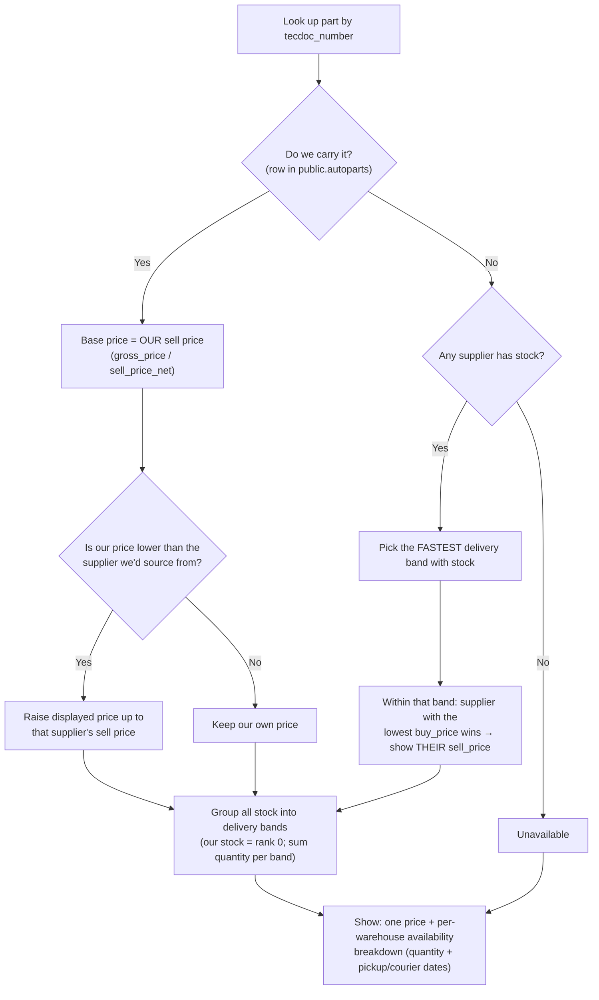

# Pricing & Delivery Model — How We Decide the Price and the Delivery Date

This document explains, in plain words, how the shop decides **one price** and **one
delivery date** to show for a part. It is the human-readable companion to the code in
`apps/api/src/inventory/` — if the two ever disagree, the code wins, but please update
this file too so we don't forget *why* it works this way.

> **One-line summary:** We sell from **our own stock first** (and never undercut our
> suppliers on price), and when we don't carry a part we pick the supplier offer that
> arrives **fastest**, breaking ties by the supplier that is **cheapest for us to buy
> from**.

---

## The two places stock can come from

| Source | Table | Role | Price we read |
|---|---|---|---|
| **Our own stock** | `public.autoparts` | **Primary** — checked first | Our own sell price, taken directly: `sell_price_net` (ex-VAT) and `gross_price` (inc-VAT). We never recompute VAT for our own stock. |
| **Supplier stock** | `public.supplier_stock` | **Fallback** — layered on top | The supplier's `sell_price` (VAT-inclusive). We also read `buy_price` (what it costs *us*) to decide which supplier to source from. |

Both tables are owned by the backoffice; the shop only **reads** them (read-only,
column-scoped). We match rows by `tecdoc_number`.

---

## Delivery dates (the "delivery bands")

Every offer is sorted into a **delivery band**. Bands are ranked from fastest to
slowest — this ranking is the backbone of the whole algorithm.

| Rank | Delivery band | Meaning | Nominal working days |
|---|---|---|---|
| 0 | Own stock | **Our own stock** — ships immediately | 0 |
| 1 | Within the hour | A local supplier warehouse can deliver within the hour | 0 |
| 2 | Same day | Delivered today (if ordered before the daily cut-off) | 0 |
| 3 | Next day | Delivered the next business day | 1 |
| 4 | Two days | Delivered within two business days | 2 |
| 5 | Three days | Delivered within three business days | 3 |
| — | None | Nothing available anywhere (unavailable) | — |

> **This rank is internal only.** It is a numeric `DeliveryOutcome.rank`
> (`delivery.ts`) used to pick the fastest offer for the price; own stock is
> fixed to rank 0 and each supplier `DeliveryRule` maps to the rank above. The
> API does **not** expose a stock-status enum. What the customer sees is the
> single price plus the per-warehouse `availabilityByWarehouse` breakdown (see
> below); the frontend derives the delivery label per warehouse from that.

### How a supplier row gets its band

The band for a supplier line comes from a fixed map of **supplier + warehouse →
delivery rule** (in `delivery.ts`, mirroring the backoffice warehouse enums). Examples:

- **Intercars** `B24` (local Pleven) → within the hour; `B01`/`B02` (Sofia) → same-day;
  `HZA`/`R00` → 2 days; `HSN` → 3 days.
- **AutoPlus** `MAGAZIN_PLEVEN` → within the hour; central/Lovech/Manimpex → same-day.
- **AutoKomers** `CENTRAL` → next day.
- **Auto1** `CENTRAL` → next day; `REGIONAL` → 2 days.

The **same-day cut-off** is `11:00` `Europe/Sofia`: a "same-day-before-cut-off" warehouse
delivers **today** if it's before 11:00, otherwise **tomorrow**.

> The full delivery-date computation — shop working hours (incl. Saturday), the
> Bulgarian holiday calendar, the per-warehouse order cut-offs, the
> within-the-hour clock time, and the B2C pickup/courier projection — is
> documented in [DELIVERY-LOGIC.md](./DELIVERY-LOGIC.md). This section only
> covers how a supplier row gets its delivery *band*.

If we ever see a supplier/warehouse combination that isn't in the map, we **drop that
offer** (treat it as no stock) and log an alert — we would rather show nothing than
invent a delivery promise we can't keep.

### How much is available per band

Within each band we **add up the quantity** from every source that falls in it. Our own
stock always lands in the own-stock (rank 0) band. Suppliers add their quantity onto their
own bands. The **fastest band that has stock** is what sets the displayed price. The
availability itself is only reported per warehouse: the customer-facing breakdown
(`availabilityByWarehouse`) is what the product page renders to say "4 available now, 5
more in 2 days", carrying each warehouse's quantity and its projected pickup/courier
dates. There is no separate top-level quantity field, and no stock-status/estimated-days
field — they would only ever duplicate (and risk disagreeing with) the per-warehouse
breakdown, which the frontend reads directly for the delivery label.

---

## The price rule

There is always **one price** shown to every customer. (Mechanic trade discounts are a
separate thing applied later — they are *not* part of this model.) How we pick that price
depends on whether we carry the part.

### Case A — We carry the part (a row exists in `autoparts`)

1. **Start from our own sell price** (`gross_price` inc-VAT, `sell_price_net` ex-VAT).
2. **Never undercut the supplier we would actually buy from.** We look at the supplier we
   would source the part from (fastest delivery, then cheapest `buy_price`) and compare:
   - If **our price is lower** than that supplier's sell price → we **raise** our displayed
     price up to the supplier's price (so we don't sell below the market and lose margin).
   - If **our price is the same or higher** → we **keep our own price**.
3. This holds even if we currently have **0 units** of our own: the price still locks to
   ours (with the rule above), and the delivery date is driven by the supplier stock.

> This is exactly the behaviour described as: *"prefer our own price, but if our price is
> lower than the supplier's, use the supplier's price."*

### Case B — We do NOT carry the part (no `autoparts` row)

1. Look at all suppliers that have stock.
2. **Prefer faster delivery first.** Pick the fastest delivery band that has stock.
3. **Within that band, the supplier with the lowest `buy_price` wins** — that's the
   supplier we'd actually buy from (cheapest cost = best margin for us).
4. We **display that winning supplier's `sell_price`** (and derive the ex-VAT figure from
   it using `VAT_RATE`, default 20%).

> Note we rank by **`buy_price`** (our cost), not by the supplier's sell price. We choose
> who *we* buy from, then show *their* sell price.

---

## Worked examples

**1. We carry it, and our price is higher → keep ours.**
Our stock: `gross_price = €18.00`. Cheapest supplier sells at `€15.00`.
→ Show **€18.00**, ships from own stock. (We don't drop our price to chase a supplier.)

**2. We carry it, but our price is lower → raise to the supplier's price.**
Our stock: `gross_price = €12.00`. The supplier we'd source from sells at `€15.00`.
→ Show **€15.00**, ships from own stock. (We never undercut that supplier.)

**3. We don't carry it → cheapest-to-buy supplier in the fastest band sets the price.**
Two suppliers, both **next-day**: A `buy €9.00 / sell €14.00`, B `buy €10.00 / sell €13.00`.
→ We'd buy from **A** (lower buy price), so show **A's €14.00** in the next-day band.
Quantity = A's qty **+** B's qty (both in the next-day band).

**4. Faster beats cheaper.**
Supplier A: **same-day**, sells `€16.00`. Supplier B: **in 2 days**, sells `€12.00`.
→ Fastest band wins → show **A's €16.00** in the same-day band. We prefer the faster
delivery even though B is cheaper.

---

## The decision at a glance

---

## VAT

- **Our own stock:** both the ex-VAT (`sell_price_net`) and inc-VAT (`gross_price`) prices
  come straight from the row. We do **not** recompute VAT.
- **Supplier stock:** `sell_price` is already VAT-inclusive. We derive the ex-VAT figure as
  `round(incVat / (1 + VAT_RATE))`, where `VAT_RATE` defaults to `0.2` (20%).

All money is handled as **integer EUR cents** everywhere.

---

## Edge cases & safety

- **We carry it but hold 0 units, and no supplier has it:** the part is shown as
  out of stock, but the price fields still reflect our own price.
- **Unknown supplier/warehouse mapping:** that offer is dropped and an alert is logged
  (never shown to the customer).
- **A supplier row with no usable quantity:** treated as "unknown" and excluded.
- **A line filed under another brand, or under none:** not this article's stock.
  The read matches `tecdoc_number` **and** `tecdoc_supplier_id`, so a number two
  suppliers share no longer quotes one brand's part from the other's shelf.
- **Read failure policy:** there is one live read — `getAvailability(articles)`,
  which toggles only the DB query by input size (single-row vs batch) — and it
  **always fails closed**: on a read error it throws `InventoryUnavailableException`
  (503 / `INVENTORY_UNAVAILABLE`) rather than marking anything as falsely out of
  stock. Every surface that uses it (the product-page buy box, listing grid, search,
  substitutes, and the cart/checkout re-validation) shows a scoped "try again later"
  state on that error. Note this is *only* about read failures: an article that
  genuinely has no stock always resolves to `available: false`. See
  `docs/ARCHITECTURE.md` → *Pricing, Availability and Pre-Checkout Check*.

---

## Where this lives in code

| Concern | File |
|---|---|
| The price + delivery selection (the heart of it) | `apps/api/src/inventory/best-offer.ts` |
| Delivery bands, ranking, warehouse→rule map, same-day cut-off | `apps/api/src/inventory/delivery.ts` |
| Resolving a supplier row to a delivery band (adds the clock) | `apps/api/src/inventory/delivery-speed.resolver.ts` |
| Reading our own stock | `apps/api/src/inventory/autoparts.repository.ts` |
| Reading supplier stock | `apps/api/src/inventory/supplier-stock.repository.ts` |
| Wiring it together + VAT + the fail-closed availability read | `apps/api/src/inventory/inventory.service.ts` (`getAvailability`) |
| Cached metadata / live availability split | `apps/api/src/catalog/catalog.service.ts` (`getArticlesAvailability`) |
| Merging cached grid metadata with the live availability read | `apps/web/src/lib/catalog/merge-availability.ts` |
| The shape returned to the frontend | `packages/shared/src/dto/inventory.dto.ts` |

---

## Known future work (intentionally not done yet)

- **Per-mechanic trade discount** applied on top of this single locked price.
- **Original parts.** A stock line is matched on the whole article identity —
  `tecdoc_number` **and** `tecdoc_supplier_id` — so 70,677 lines filed under an
  internal OE code instead of a TecDoc supplier id are unreachable. They are a
  different relation ("the original this part replaces") and need their own
  lookup, off an aftermarket article's `oemNumbers`, shown as a separate offer.
  See `TODO(inventory-oe-parts)` in `inventory.service.ts`.
- **Matching beyond `tecdoc_number`** (e.g. `supplier_code` / `catalog_number`) for rows
  that have no TecDoc number.
- **Real warehouse→delivery-day values** refined as we learn each supplier's true lead
  times.
